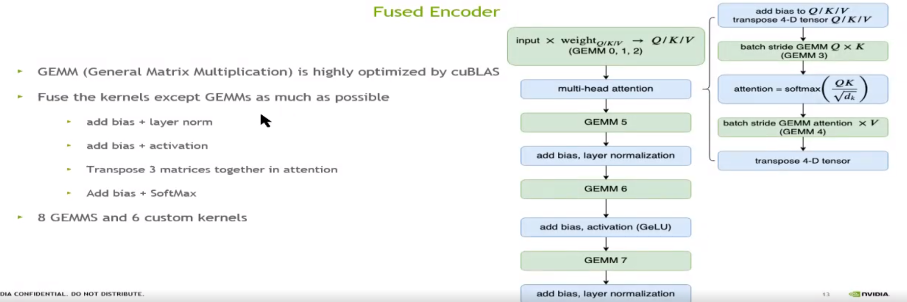
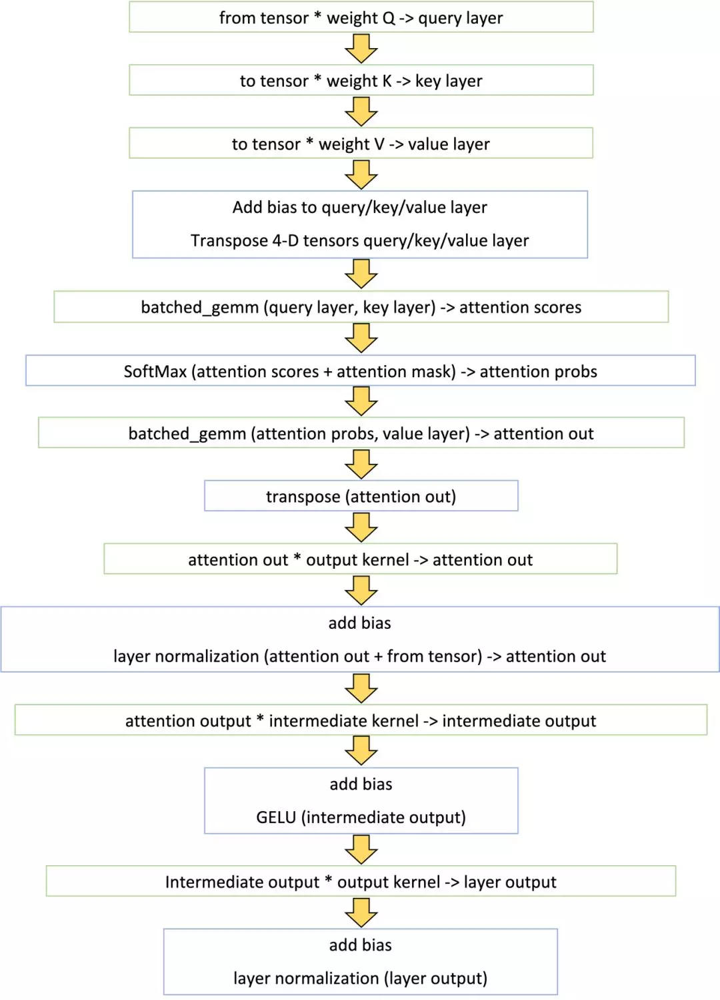

# **Faster transformer1.0**

针对beart,优化transformer 中的 encoder部分

**Faster transformer2.0**

增加实现 decoder / beam search ( FP16/FP32)

FastTransformer v2 adds a highly optimized OpenNMT-tf based decoder and decoding for inference in FasterTransformer v1, including C++ API and TensorFlow op. The experiments show that FasterTransformer v2 can provide 1.5 ~ 11 times speedup on NVIDIA Telsa T4 and NVIDIA Tesla V 100 for inference.

**Faster transformer3.0**

增加int8

FasterTransformer v3.0 adds the supporting of INT8 quantization for cpp and TensorFlow encoder model on Turing and Ampere GPUs.

**Faster transformer3.1**

支持pytorch

First, FasterTransformer v3.1 adds the supporting of INT8 quantization of PyTorch encoder model on Turing and Ampere GPUs. Second, v3.1 improves the performances of encoder on FP16 and INT8. Compared to v3.0, v3.1 provides at most 1.2x speedup on T4 FP16, and 1.7x speedup on T4 INT8. Third, v3.1 supports the inference of GPT-2 model.

1. fastertransformer1.0：主要源码
2. 1. cuda：优化后的kernel以及对multi-head attention整体的封装（没过线性层）
   2. tf_op：tensorflow operation和OpKernel的注册（op理解为声明、Opkenerl是定义）
   3. trt_plugin：tensorRT的实现（可以支持multi streaming太赞了）
   4. bertencodertransformer.h：transformer整体的封装
3. sample：cpp、tensorflow、tensrflow_bert、tensorRT的调用FTF的示例
4. tools：根据参数选择最优的矩阵乘法（GEMM=General Matrix Multiplication）

## 简要总结

## 1、除矩阵乘法外的层融合

功效：减少kernel调用，进而减少global memory 的调用（每一个kernel都会调用global memory）

方法：

将除矩阵乘法以外的所有kernel都进行了尽可能的融合，单层Transformer的计算流程如下图所示：

如图所示，Faster Transformer只用了14个kernel就完成了原来将近60个kernel的计算逻辑。这其中，8个kernel是通过调用cuBLAS接口计算矩阵乘法（绿色框），其余6个是自定义kernel （蓝色框）。

**针对batch size比较小的场景（例如问答，TTS等），简单的融合后，基本上就可以达到很好的性能。这类场景下，TensorFlow原生实现的最大瓶颈就在于频繁的kernel launch，融合后大大降低了launch的开销，因此可以比较轻易地获得很好的加速效果。**

**针对大batch的场景，我们需要对矩阵乘法和所有的自定义kernel做精细的调优，才能达到很好的加速效果。我们从矩阵乘法算法选择，非矩阵乘法操作的参数配置，SoftMax多版本实现，以及数据结构类型等几个方面对大batch的情况进行了专门的调优。**

## 2、使用cuBLAS优化矩阵乘法

功效：在不同情况下使用不同的矩阵乘法函数及参数，达到性能最优

方法：首先针对矩阵乘法，在调用cuBLAS的接口时，可以指定性能最优的算法。特别是针对Volta和Turing架构的GPU，使用Tensor Core进行半精度计算时，当精度满足需求的情况下，累加器也可以选择半精度，从而进一步提升性能。

## 3、对所有的自定义kernel做精细的调优

概要：除矩阵乘法以外的6个kernel，大部分都是对矩阵乘的结果进行一些element-wise的操作。输入矩阵的大小，跟4个参数有关，batch size，句子长度，attention的head数量以及每个head的维度。针对不同的应用场景，参数大小可能极为不同。比如在线问答类的场景，batch size可能为会很小，通常为1。而广告推荐或者搜索类的场景，batch size通常跟候选集大小有关，一般会是几百的规模。这样，输入矩阵的行数变化范围可能是几十到上千。因此，我们需要针对不同的情况，动态的调整kernel launch时的配置参数（grid和block的大小），甚至要针对同一个功能实现多个不同版本的kernel函数，例如，SoftMax的计算就有两个不同的实现版本。

 主要手段:

1. grid和block的大小的调整

2. memory的优化：读写一次global ，用寄存器存储中间结果

3. 计算优化：使用 fast math function（低精度近似计算）

   将1/sqrtf计算替换为rsqrtf函数

4. SoftMax优化：针对大/小Batch_size 情况，实现两套方案。

5. GELU激活函数以及Layer Normalization 优化

   

## 4、针对半精度FP16优化——针对Turing volta架构

在kernel的实现中，将输入的half指针转成half2类型，并使用了half2相关的数学函数。这样不仅仅可以达到2倍于half的访存带宽和计算吞吐，还可以极大地减少指令的发射数量。其次，在SoftMax以及Layer Normalization的操作中，为防止求和溢出，将数据以half2的形式读入后，会转成float2类型，来做求和计算。

half2好处：

相比half，极大降低读写和访存指令（in sterucctions）的数量，有更高的吞吐速度 （例如同时计算两个FP16加法操作）

