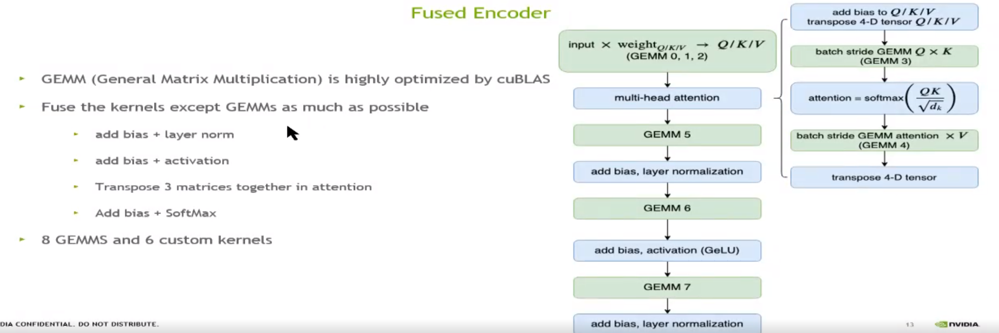
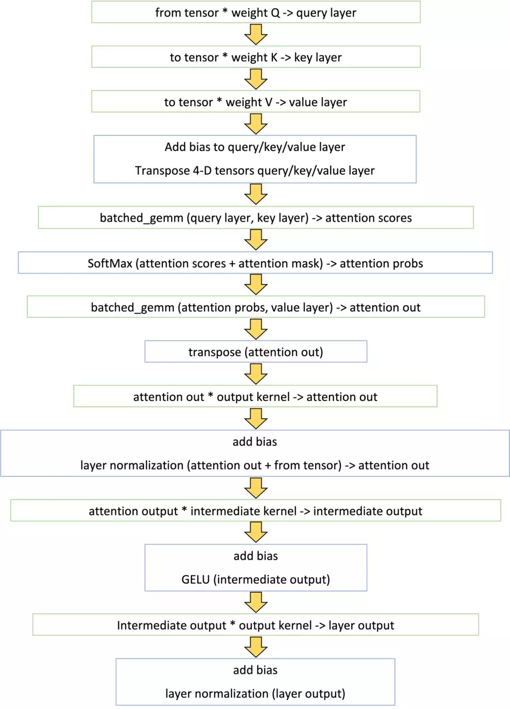

# **Faster transformer1.0**

针对beart,优化transformer 中的 encoder部分

**Faster transformer2.0**

增加实现 decoder / beam search ( FP16/FP32)

FastTransformer v2 adds a highly optimized OpenNMT-tf based decoder and decoding for inference in FasterTransformer v1, including C++ API and TensorFlow op. The experiments show that FasterTransformer v2 can provide 1.5 ~ 11 times speedup on NVIDIA Telsa T4 and NVIDIA Tesla V 100 for inference.

**Faster transformer3.0**

增加int8

FasterTransformer v3.0 adds the supporting of INT8 quantization for cpp and TensorFlow encoder model on Turing and Ampere GPUs.

**Faster transformer3.1**

支持pytorch

First, FasterTransformer v3.1 adds the supporting of INT8 quantization of PyTorch encoder model on Turing and Ampere GPUs. Second, v3.1 improves the performances of encoder on FP16 and INT8. Compared to v3.0, v3.1 provides at most 1.2x speedup on T4 FP16, and 1.7x speedup on T4 INT8. Third, v3.1 supports the inference of GPT-2 model.


1. fastertransformer1.0：主要源码
2. 1. cuda：优化后的kernel以及对multi-head attention整体的封装（没过线性层）
   2. tf_op：tensorflow operation和OpKernel的注册（op理解为声明、Opkenerl是定义）
   3. trt_plugin：tensorRT的实现（可以支持multi streaming太赞了）
   4. bertencodertransformer.h：transformer整体的封装
3. sample：cpp、tensorflow、tensrflow_bert、tensorRT的调用FTF的示例
4. tools：根据参数选择最优的矩阵乘法（GEMM=General Matrix Multiplication）

## 简要总结

encode 公式 https://blog.csdn.net/qq_30614345/article/details/103578545

## 1、除矩阵乘法外的层融合

功效：减少kernel调用，进而减少global memory 的调用（每一个kernel都会调用global memory）

方法：




将除矩阵乘法以外的所有kernel都进行了尽可能的融合，单层Transformer的计算流程如下图所示：



如图所示，Faster Transformer只用了14个kernel就完成了原来将近60个kernel的计算逻辑。这其中，8个kernel是通过调用cuBLAS接口计算矩阵乘法（绿色框），其余6个是自定义kernel （蓝色框）。

​	

假设行优先存储的矩阵A，如果不对矩阵做任何转秩，按照cublas列优先读入就变成了A(T)，原先的A*B就变成了A(T)*B(T)，如果不是方阵，这两/矩阵能不能乘起来都不一定有保证。

如果要A*B，cublas的输入顺序应该是B在前，A在后。C(T) = (A*B)(T) = B(T)*A(T)，culbas输出的列优先的C(T)到了行优先的C++矩阵就自动转秩成了C。

```c++
//transformer_fp32.py
	encoder_transformer_->forward();
		//bert_encoder_transformer.h
		attention_->forward();
			//open_attention.h
			forward();
				//1-3
				cublasGemmEx //attr_kernel_Q 
                cublasGemmEx //attr_kernel_K
                cublasGemmEx //attr_kernel_V
                //sqrtf(dk)
                DataType_ scaler = 1 / sqrtf(size_per_head_ * 1.0f);

				//multi-Head attention
      			multiHeadAttr_nofuse_kernelLauncher()
                     //4 open_attention.cu  
                     // add bias
                     add_QKV_bias<DataType_><<<grid, block, 0, stream>>>
                     //5 Q*K^T
                     cublasGemmStridedBatchedEx
                     //6 softmax 
                     //https://zhuanlan.zhihu.com/p/341059988
                     //https://zhuanlan.zhihu.com/p/271740706
                    //https://developer.nvidia.com/blog/faster-parallel-reductions-kepler/
                     if(batch_size * head_num <= 120)
						softmax_kernel_v2<DataType_>;
							blockReduceMax
                                warpReduceMax
                            blockReduceSum
                                warpReduceSum
   					 else
                        softmax_kernel<DataType_>;
				     // softmax(xxxx)*V
                     cublasGemmStridedBatchedEx
                     //8 transpose
                     transpose
                //9
                cublasGemmEx
                //10 add bias + layernorm
                add_bias_input_layernorm_kernelLauncher
                     add_bias_input_layernorm
                         // add bias (cuda_kernels.cu 134)
                         
                         // layernorm  
                         //https://blog.csdn.net/liuxiao214/article/details/81037416
                         //https://liumin.blog.csdn.net/article/details/85075706
							blockReduceMax
                         		//并行规约                      	    				                          //https://blog.csdn.net/wujianing_110117/article/details/113363255
                       //https://blog.csdn.net/qq_16097611/article/details/51585379
                                warpReduceMax
                //11
                cublasGemmEx    
                //12 add bias + activation
                add_bias_act_kernelLauncher
                         add_bias_act
                         	gelu
                //13
                cublasGemmEx
                //14 add bias + layernorm  
                add_bias_input_layernorm_kernelLauncher


```


2.1 相比1.0的特別之

```c++
softmax 
    
    增加了half2 但是只在seq超过32,且为偶数情况下使用 softmaxV3
    原因，seq在使用过程中基本上90%均为偶数，在seq小于32情况下，提速不明显
    
    
    
    
            
```

