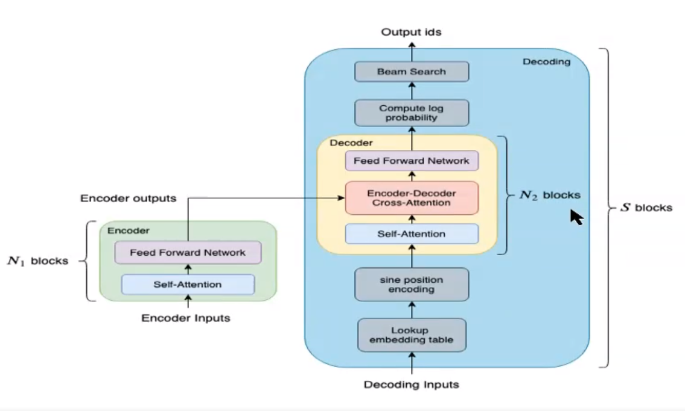
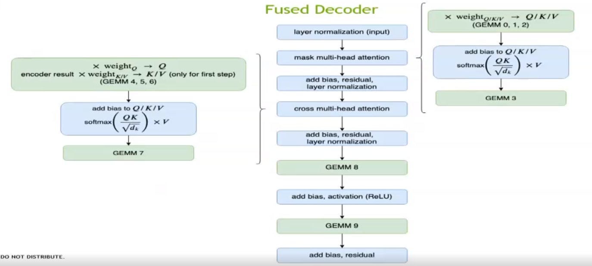
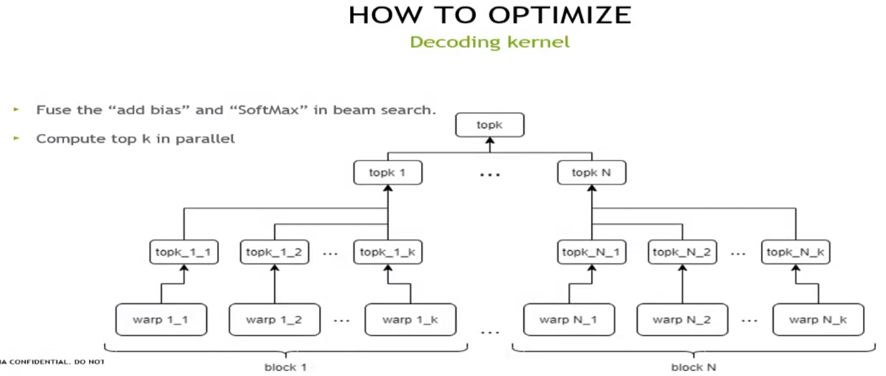

# **Faster transformer2.0**

 **相比于1,0.增加decoding(decoder+前后处理)部分的优化，*




Encoder: single layer BERT equivalented transformer

Decoder: single layer decoder transformer

Decoding: whole translating progress

```python
decoding(encoder_result,start_id):
	id = start_id
	while(finished == false):
		decoder_input = lookup_embedding_table(id)
		decoder_input = sine_position_encoding(decoder_input)
		for l = 1:num_layer: #"decoder 调用6层"
			decoder_output = decoder(decoer_input,encoder_output,num_layer) 
		prob = dense(decoder_output)
		id = beamsearch(prob,candidate_number)
```


## 简要总结

## 1、decoder除矩阵乘法外的层融合

功效：减少kernel调用，进而减少global memory 的调用（每一个kernel都会调用global memory）

方法：

将除矩阵乘法（GEMMs）以外的所有kernel都进行了尽可能的融合，单层Transformer的计算流程如下图所示：




如图所示，用了16个kernel就完成了原来将近70个kernel的计算逻辑。

这其中，绿色框）调用cuBLAS接口计算矩阵乘法，其余（蓝色框）是自定义kernel 。

## 2、使用cuBLAS优化矩阵乘法

功效：在不同情况下使用不同的矩阵乘法函数及参数，达到性能最优(有工具遍历然后选出最优)

方法：首先针对矩阵乘法，在调用cuBLAS的接口时，可以指定性能最优的算法。特别是针对Volta和Turing架构的GPU，使用Tensor Core进行半精度计算时，当精度满足需求的情况下，累加器也可以选择半精度，从而进一步提升性能。


## 3、对所有的自定义kernel做精细的调优

概要：除矩阵乘法以外的6个kernel，大部分都是对矩阵乘的结果进行一些element-wise的操作。输入矩阵的大小，跟4个参数有关，batch size，句子长度，attention的head数量以及每个head的维度。针对不同的应用场景，参数大小可能极为不同。比如在线问答类的场景，batch size可能为会很小，通常为1。而广告推荐或者搜索类的场景，batch size通常跟候选集大小有关，一般会是几百的规模。这样，输入矩阵的行数变化范围可能是几十到上千。因此，我们需要针对不同的情况，动态的调整kernel launch时的配置参数（grid和block的大小），甚至要针对同一个功能实现多个不同版本的kernel函数，例如，SoftMax的计算就有两个不同的实现版本。

 主要手段:

1. grid和block的大小的调整

2. memory的优化：读写一次global ，用寄存器存储中间结果

3. 计算优化：使用 fast math function（低精度近似计算）

   将1/sqrtf计算替换为rsqrtf函数

4. SoftMax优化：针对大/小Batch_size 情况，实现两套方案。

5. GELU激活函数以及Layer Normalization（**reduceMAX reduceSUM优化**——使用__shfl_xor_sync ） 优化

6. **topk 优化，并行多个block**（beam search 中使用）




## 4、针对半精度FP16优化——针对Turing volta架构

在kernel的实现中，将输入的half指针转成half2类型，并使用了half2相关的数学函数。这样不仅仅可以达到2倍于half的访存带宽和计算吞吐，还可以极大地减少指令的发射数量。其次，在SoftMax以及Layer Normalization的操作中，为防止求和溢出，将数据以half2的形式读入后，会转成float2类型，来做求和计算。


half2好处：

相比half，极大降低读写和访存指令（in sterucctions）的数量，有更高的吞吐速度 （例如同时计算两个FP16加法操作）


