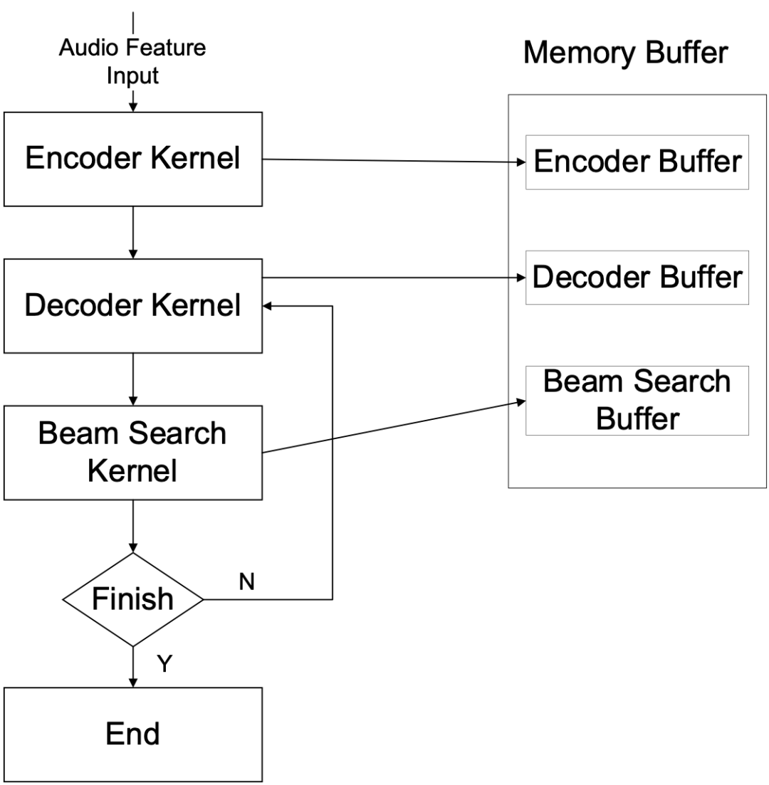
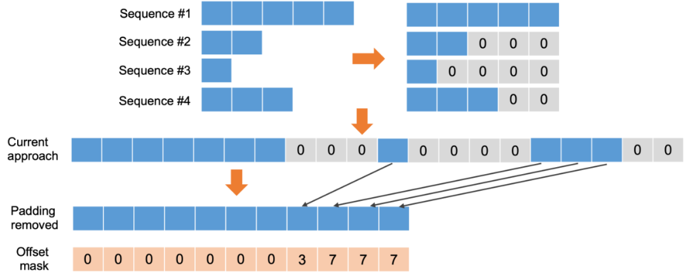

# 快手transformer

## 相关资料：

详细介绍https://mp.weixin.qq.com/s?__biz=MzA3MzI4MjgzMw==&mid=2650808102&idx=3&sn=cd8f1de3d64c0bfe0e0ba28a526629df&chksm=84e5db58b392524eafed49dd893d064202faebad4cf80beacde641a25a1616d1e83a51354c26&mpshare=1&scene=1&srcid=0201FWvQaTbeaMuyh5ZfZct5&sharer_sharetime=1612160971018&sharer_shareid=e8f6cb0cedae6b609ccbdb2613b4167d&exportkey=AfQOyMb1DO4Nki4ZbVjcrlY%3D&pass_ticket=KFZjvX3HK%2BIVakmdDG0Im0cOhvVzikV%2Bo4NkPG9zgMYsNQQZC9142btGeJYFCTh2&wx_header=0#rd

**1. 算子融合和重构**

​	和英伟达一张图

**2. 混合精度量化**

​		Half2

***3. 内存管理优化***

研究者在内存管理上进行了大量优化工作。图  是 Transformer Encoder、Decoder 及 Beam Search 的内存管理示意图。

他们对这三个模块分别预先分配单独的 GPU 内存。主要使用的内存优化方法包含：

1) 内存 Sharing: 针对 Encoder 批处理输入数据而无须缓存中间数据这一特点，研究者提出了 Ping-pong Buffer 的策略，将 Encoder 的内存分为两大块——Buffer A 和 Buffer B。第 I 层从 Buffer A 读取数据写入 Buffer B，第 I+1 层会从 Buffer B 读取第 I 层的输出，同时将输出写入 Buffer A。这样可避免每层单独开辟内存空间，能将 Encoder 占用的内存减小为原来的 1/N（N 是 Encoder 的层数）。此方法可极大地节省 Encoder 在运行过程中所占用的内存，使得支持更大的 Batch Size 的输入数据成为可能。

2) 内存 Caching: 在前文 Decoding 的工作机制描述中，研究者详细分析了 Transformer 所存在的重复计算问题。为了避免 Decoder 和 Beam Search 的重复计算开销，他们将 Decoder 的部分中间层输出在 GPU 内存上 Caching 起来，保留已经计算过的 Beam Search 路径。当需要更新路径的时候，不需要重复计算已经计算过的路径。

3) 内存 Pre-alloation: 很多基于 Transformer 的应用需要支持动态的 Batch Size 和序列长度，为了避免重复申请删除 GPU 内存所带来的巨大开销，可根据服务所可能出现的最大 Batch Size 和序列长度对每个模块的内存进行预先分配。

***4. 输入 Padding 移除***

输入 Padding 是很多 NLP 和语音应用中的常见预处理步骤。在同一个 Batch 的数据内，不同序列长度可能会不一样，因为 Transformer 通常只能接收等长的序列数据，实际都会将短序列通过加空帧进行补齐。这些空帧虽参与 CUDA Kernel 运算，但很多时候对最终计算结果并没有影响，反而给 GPU 造成了额外的运算负担。因此，可以去掉这些空帧，并将其相对位置记录并保存至 Offset Mask。通过 Offset Mask 可以实现去空帧序列和原始序列的互相转换。相比之下，去空帧后的数据序列会缩短很多，所需计算量可大幅缩减，见图 9

*图 9：输入 Padding 移除的方案 - 通过引入 Offset Mask，移除 Padding 的 Sequence 和原始的 Sequence 可以互相转换重建*

需要注意的是，去掉空帧并不是对所有 CUDA Kernel 的运算都没有影响。也就是说，这种方法并不是通用的，其有效性取决于 Kernel 运算是否涉及相邻帧的数据。如果当前 Kernel 的计算只使用到帧内部数据，不涉及到相邻帧的数据，那么去除 Padding 对结果没有影响。

针对具体的模型，可以将模型的计算 Kernel 分为两类：(i) Kernel 运算完全基于帧内数据，去掉空帧对此 Kernel 的运算结果无影响；(ii) Kernel 运算涉及相邻帧数据，去掉空帧对此 Kernel 的运算结果有影响。可以在前一类 Kernel 前将 Padding 去掉，在后一类 Kernel 前可额外插入「Rebuild Padding」Kernel 重建原始序列，如图 10 所示。

*图 10：通过对 CUDA Kernel 的分类判断是否可以移除 Padding*

需要注意的是，「Remove Padding」和「Rebuild Padding」的 Kernel 会带来额外开销，整体设计需要考虑开销和收益的平衡。一般而言，输入 Batch 数据各序列的长度差距越大，去掉 Padding 带来的收益越高。

在 Transformer 架构中，因为所有 Attention 模块都会涉及相邻数据帧的计算，所以需要在 Attention 模块之前进行重建。而对于 Decoding，因为大部分 Kernel 都涉及到相邻帧计算，去掉 Padding 带来的收益不明显，因此此方法主要在 Encoding 端使用。

**5. GEMM 配置优化**

  

